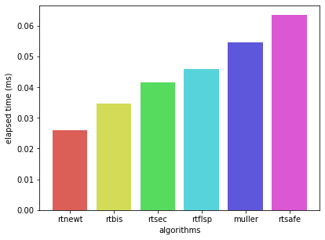
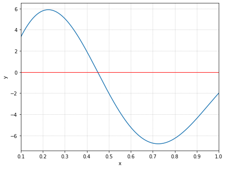
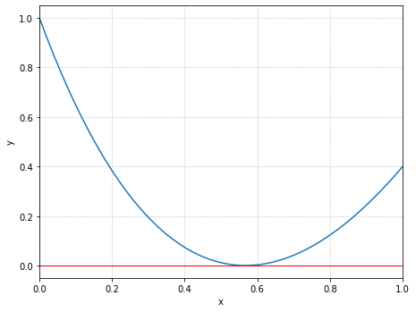
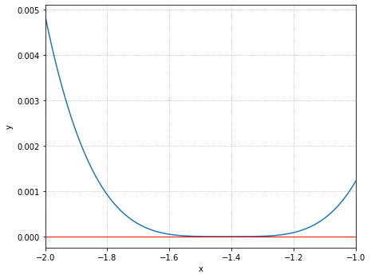
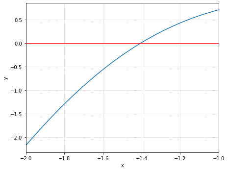

# HW 03 - Root Finding

## 0. How to build
```bash
cd nr
make
cd ..
make
```

## 1. Problem 1
우선 `zbrak`를 사용하여 해의 범위를 구한 뒤, 각 방법론을 사용하여 정확한 해를 구하였다.
이 과정은 pointer to function을 활용해 미리 방법론을 배열에 담기만 하면 for문으로 작동적으로 순회하며 해를 구할 수 있도록 코드를 작성하였다. 그 결과는 다음과 같다.

```
METHOD: bisection
roots = 2.404826 5.520078 8.653728

METHOD: linear interpolation
roots = 2.404825 5.520078 8.653728

METHOD: secant
roots = 2.404825 5.520078 8.653728

METHOD: newton-raphson
roots = 2.404826 5.520078 8.653728

METHOD: newton with bracketing
roots = 2.404826 5.520078 8.653728
```

## 2. Problem 2
Numerical Methods for Engineers 책의 Muller 파트를 참고하여 muller.c를 작성하였다.
그 결과는 다음과 같다.

```
METHOD: muller
roots = 2.404826 5.520078 8.653728
```

## 3. Problem 3
bessl function의 해를 각 방법론당 100만번씩 구한 뒤 평균을 내는 방식으로 성능을 측정하였다. 그 결과는 다음과 같다.

```
METHOD: bisection
avg. elapsed time: avg. 0.03481ms

METHOD: linear interpolation
avg. elapsed time: avg. 0.04615ms

METHOD: secant
avg. elapsed time: avg. 0.04159ms

METHOD: newton-raphson
avg. elapsed time: avg. 0.02615ms

METHOD: newton with bracketing
avg. elapsed time: avg. 0.06347ms

METHOD: muller
avg. elapsed time: avg. 0.05473ms
```



## 4. Problem 4

### 1. 10exp(-x)sin(2πx) - 2 = 0, x ∈ [0.1, 1]
- 그래프  

- 결과
```
FUNCTION 1 (domain: [0.1, 1.0])
root: 0.449261
```

### 2. x²-2x·exp(-x) + exp(-2x) = 0, x ∈ [0, 1]
- 그래프  

- 결과  
rtsafe는 두 기준점에서의 함수값의 부호가 서로 다름을 요구한다. 하지만 본 함수의 경우 x=0, x=1에서 부호가 같으므로 rtsafe 함수만으로는 해를 구할 수 없다.

### 3. cos(x + sqrt(2)) + x(x/2 + sqrt(2)) = 0, x ∈ [-2, -1]
- 그래프  

- 결과  
rtsafe는 두 기준점에서의 함수값의 부호가 서로 다름을 요구한다. 하지만 본 함수의 경우 x=-2, x=-1에서 부호가 같으므로 rtsafe 함수만으로는 해를 구할 수 없다.

### 4. sin²(x) - x² + 1 = 0, x ∈ [-2, -1]
- 그래프  

- 결과
```
FUNCTION 4 (domain: [-2.0, -1.0])
root: -1.404492
```
